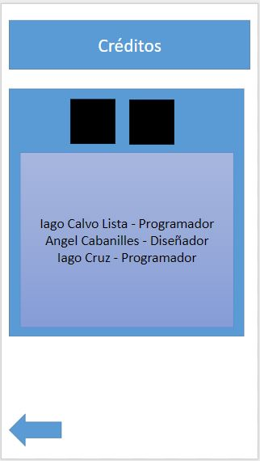
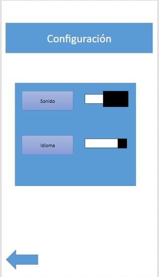
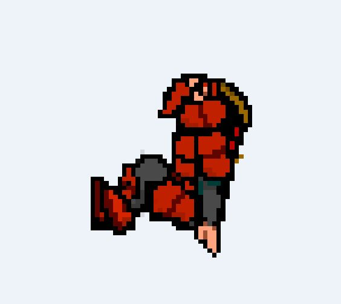
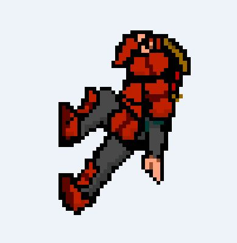
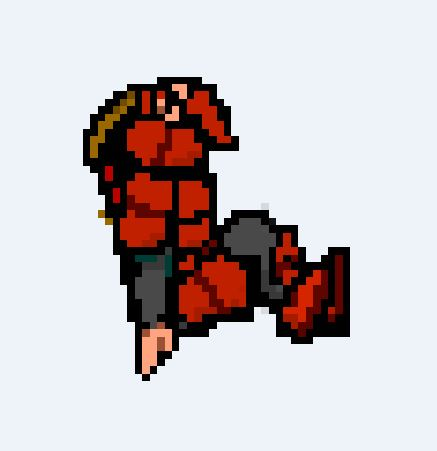
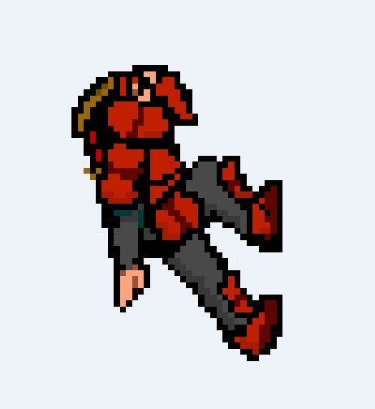
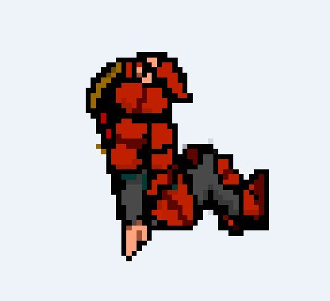
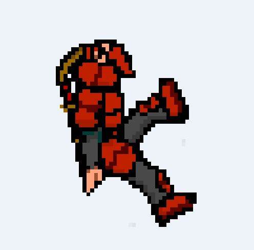

# [Shoten Samurai - GDD](shotenSamurai.html)
- [Shoten Samurai - GDD](#shoten-samurai---gdd)
    - [Introducción](#introducci%C3%B3n)
        - [Concepto del juego](#concepto-del-juego)
        - [Características distintivas](#caracter%C3%ADsticas-distintivas)
        - [Género](#g%C3%A9nero)
        - [Proṕosito y Público objetivo](#prop%CC%81osito-y-p%C3%BAblico-objetivo)
        - [Jugabilidad](#jugabilidad)
        - [Estilo visual](#estilo-visual)
        - [Alcance](#alcance)
    - [Mecánicas del juego](#mec%C3%A1nicas-del-juego)
        - [Jugabilidad](#jugabilidad-1)
            - [Niveles](#niveles)
            - [Dificultad](#dificultad)
            - [Puntuación](#puntuaci%C3%B3n)
        - [Flujo del juego](#flujo-del-juego)
        - [Personajes y objetos](#personajes-y-objetos)
            - [Samurái](#samur%C3%A1i)
            - [La Torre](#la-torre)
            - [Objetos del escenario](#objetos-del-escenario)
        - [Movimientos](#movimientos)
        - [Interacciones](#interacciones)
    - [Interfaz](#interfaz)
        - [Diagrama de flujo](#diagrama-de-flujo)
        - [Menú Principal](#men%C3%BA-principal)
        - [Créditos](#cr%C3%A9ditos)
        - [Mejores puntuaciones](#mejores-puntuaciones)
        - [Configuración](#configuraci%C3%B3n)
        - [Pantalla principal](#pantalla-principal)
        - [Game Over](#game-over)
    - [Arte](#arte)
        - [Arte 2D](#arte-2d)
        - [Animaciones 2D](#animaciones-2d)
        - [Sonido](#sonido)
## Introducción
Se trata del documento de diseño de juego de *Shoten Samurai*, diseñado para navegadores web, tanto para ordenadores como dispositivos móviles. Este juego se diseñará exclusivamente con herramientas de W3C como HTML, CSS y JavaScript.
Se detallarán los conceptos claves del desarrollo del juego incluyendo mecánicas, arte, objetivos, controles, etc.
### Concepto del juego
*Shoten Samurai* es un juego en el que controlamos a un samurai que decide escalar una extraña torre que se está derrumbando, esquivando o destruyendo los objetos que van cayendo. 
### Características distintivas
* Un juego sencillo: un solo botón de acción para saltar.
* Una torre infinita, donde tendrás que aguantar lo máximo posible escalándola.
* Desafío constante, poniendo a prueba tus habilidades, aumentando la dificultad a medida que avanzas.
* Temática oriental con toques de humor.
### Género
La idea de *Shoten Samurai* nace de ideas como *Lumberjack*, *Geometry Dash* y *Fruit Ninja*, ideas simples y desafiantes, por lo tanto el juego es una mezcla de varios géneros como:
* **Endless Running**: La torre es infinita, escalando hasta donde aguantemos.
* **Arcade**: Cada vez más dificultad, aumentando la velocidad y los objetos en pantalla.
### Proṕosito y Público objetivo
Es un juego que está pensado para todos los públicos, tanto para gente con mucho tiempo libre que busca un desafío que lo entretenga, como para personas con poco tiempo libre y que buscan partidas cortas para consumir los ratos muertos del día a día.
### Jugabilidad
El juego se compondrá de un solo nivel infinito cuyo fondo y objetos en pantalla cambiarán según la dificultad. El personaje deberá saltar entre las dos paredes de la torre, destruyendo los objetos rompibles para conseguir más puntuación y esquivando aquellos obstáculos que le causarán una muerte terrible y dolorosa.
* **Movilidad**: Personaje que asciende por una torre, saltando de pared en pared con un ángulo de 45 grados.
*  **Obstáculos y objetos**: En las paredes habrá objetos fijos que habrá que esquivar y por el centro caerán objetos, algunos rompibles (bambú, tela, madera...) y otros indestructibles (vigas de piedra, artefactos de joyas preciosas, etc.)
### Estilo visual
Presenta una estética oriental con toques de pixel art, el juego será un reclamo para aficionados de este estilo visual y los nostálgicos de los 16 bits.
Los colores utilizados en el juego están basados en la paleta estándar representativa de la cultura oriental feudal: tonos rojizos, dorados, marrones e incluso verdes.
### Alcance
El objetivo de este proyecto es presentar un juego con mecánicas sencillas, que sea fácil de entender y muy entretenido.
En un futuro se podrán incluir mejoras en las partidas o un apartado de personalización.
## Mecánicas del juego
En este apartado se explicará con detalle todo lo relacionado con las mecánicas del juego de Shoten Samurai.
De forma concisa y clara se mostrarán todos los aspectos importantes en cuanto a las partidas se refiere; indicando cómo serán los niveles, cómo avanzará el personaje, qué objetos aparecerán por pantalla y demás.
### Jugabilidad
Los controles de *Shoten Samurai* serán simples y directos: un único click en la pantalla o en botón *space* del teclado para que el personaje salte a la otra pared. El jugador deberá calcular cuándo debe saltar para poder esquivar correctamente los objetos de los laterales, romper los que caen por el centro o para no quedarse mucho tiempo en la misma pared y perder así la partida. Todos los saltos se realizarán con un ángulo de 45 grados hacia la pared contraria.
#### Niveles
Cada partida de Shoten Samurai se desarrollará en un único escenario infinito, donde la dificultad se irá incrementando en función de cuánto aguante el jugador. El background, los objetos y algunos colores irán cambiando dependiendo de lo alto que se llegue a escalar la torre.
#### Dificultad
Cuanto más aguantemos, más se incrementará la dificultad de la siguiente forma:
* Los objetos y los obstáculos de las paredes caerán con más velocidad.
* Habrá más objetos en pantalla.
 
El jugador deberá prestar cada vez más atención y dependerá de sus propios reflejos y capacidad de predicción (en los niveles más avanzados).

#### Puntuación
Se podrán conseguir puntos de dos maneras:
* El jugador obtendrá puntuación a medida que ascienda por la torre.
* El jugador conseguirá puntos si rompe los objetos destruibles, aumentando la cantidad de puntos que consigue si los destruye de forma continua con cada salto, perdiendo el aumento de puntos si no se destruye algún objeto en el salto.

Se guardará la mejor puntuación del jugador tras finalizar la partida, pudiendo introducir su nombre.

### Flujo del juego
En este apartado se detallará, paso a paso, cómo es una partida del juego *Shoten Samurai*. Se explicarán qué opciones tendrá el jugador en la pantalla de inicio, cómo es una partida y qué pasa cuando ésta termina.
 
Cuando el jugador entra en el juego, se verá un menú de inicio con una estética pixel art con estilo japonés donde se verán todas las opciones de las que dispone el jugador.
  
Si el usuario pulsa el botón de *Créditos* , se mostrará una pantalla con el nombre de los desarrolladores del juego y los roles de cada uno, además de un link para acceder a las páginas del equipo de Heimdall Games.
  
El botón de *Mejores Puntuaciones* llevará al usuario al ranking de los jugadores, con sus respectivos nombres, que han conseguido las mejores puntuaciones.
  
Si pulsas la llave inglesa, se entrará en el menú de ajustes, donde el jugador podrá cambiar el idioma y activar o desactivar el sonido.
  
El botón de *Jugar* hará que el usuario entre directamente en la partida, donde posiblemnte se incluya un pequeño vídeo introductorio para poner en contexto al jugador y dar comienzo a la experiencia de juego como tal. El jugador deberá escalar una torre esquivando obstáculos en los laterales y a su vez rompiendo algunos de los que caen por el centro para aumentar su puntuación. Se trata de un juego tipo Endless Running, por lo tanto el objetivo del jugador es aguantar lo máximo posible sin caerse y sin ser golpeado por los objetos. Cada vez que el jugador pulse la pantalla del móvil o pulse el botón de *barra espaciadora* en el teclado, el personaje hará un salto de 45 grados a la pared opuesta. Cuanto más aguante el usuario, mayor será la dificultad de la partida, con un incremento de la velocidad y con más objetos en pantalla.
  
Si el jugador muere, se dará paso a la pantalla de *Game Over*. Aquí, el usuario podrá introducir su nombre si consigue un nuevo récord en la puntuación, además podrá volver a jugar una partida o volver al menú principal.
### Personajes y objetos
 En esta sección se detallarán los objetos que aparecerán a lo largo del juego, así como una descripción del personaje principal.
#### Samurái
 El protagonista del videojuego es un Samurái de la época feudal japonesa que se encuentra una extraña torre con un cártel muy llamativo.
 

 *Figura 1: Personaje principal.*
#### La Torre
  Al pie de esta infinita torre, el personaje se encuentra un cártel con el siguiente mensaje: "*No hay cojones a subirla*".
#### Objetos del escenario
 El protagonista tendrá que subir la torre destruyendo objetos tales como telas, tablones de madera y cañas de bambú; así como esquivando diferentes tipos de piedras y rocas.
 
  *Figura 2: Ejemplo objeto rompible.*
  
  
  *Figura 3: Ejemplo obstáculo no rompible.*
 
### Movimientos
Como se ha mencionado, el jugador está continuamente ascendiendo por la torre mientras esquiva ciertos objetos y destruye otros.

El único movimiento posible es el de saltar a la pared opuesta, realizando un salto de 45 grados sobre el eje horizontal del personaje, al pulsa la pantalla del móvil o botón de *barra espaciadora*.
 
Cuando el protagonista choque contra algún objeto de los laterales del escenario morirá, al igual que si choca contra algún objeto indestructible del centro de la torre. El mismo movimiento de salto hace que el Samurái pueda cortar algunos de los objetos que caen del centro, para conseguir más puntos.
### Interacciones
 Tal como se especificaba anteriormente, con el objetivo de dificultar la ascensión de la torre del samurái, ciertos obstáculos aparecerán en los laterales de la torre y cayendo por el centro de la misma, algunos de estos destruibles. 
 Las siguientes colisiones estarán presentes en juego:
 
* Samurái-Torre
* Samurái-Objeto
 
## Interfaz
 En esta sección se especificará con detalle cada una de las pantallas que componen *Shoten Samurai*.
 Además, se indicarán las transiciones entre ellas así como la utilidad de cada elemento de la GUI (Graphical User Interface).
 Las imágenes adjuntas son bocetos muy básicos que ilustran los componentes que debe contener cada pantalla, no obstante, se planea hacer cambios en la apariencia y disposición de los elementos.
### Diagrama de flujo
El siguiente diagrama de estados muestra las pantallas presentes a lo largo de *Shoten Samurai*, así como las transiciones entre ellas.
En puntos posteriores nos centraremos en ellas de forma individual.

*Figura 1: Diagrama de flujo de pantallas en el juego.*
### Menú Principal
A continuación el boceto de la pantalla de *Menú Principal*:

*Figura 2: Boceto del menú principal.*

Lista y descripción de todos sus componentes.
* **Botón Jugar**: Este botón mostrará la cinematica de inicio, la cual dará inicio a una nueva partida cuando acabe.

*Figura 1: Botón jugar.*

* **Botón Créditos**: Este botón llevará al usuario a la pantalla de créditos.

*Figura 1: Botón créditos.*

* **Botón Mejores Puntuaciones**: Este botón llevará a la pantalla de mejores puntuaciones.

*Figura 1: Botón para acceder a las mejores puntuaciones.*

* **Botón Configuración**: Este botón llevará a la pantalla de configuración.

*Figura 1: Botón para acceder a la configuración.*

### Créditos
A continuación el boceto de la pantalla de *Créditos*:

*Figura 3: Boceto de la pantalla de créditos.*

Lista y descripción de todos sus componentes.
* **Botón Menú**: Este botón devolverá al jugador al menú principal.

*Figura 1: Botón para volver al menú.*

### Mejores puntuaciones
A continuación el boceto de la pantalla de *Mejores puntuaciones*:

*Figura 4: Boceto de la pantalla de mejores puntuaciones.*

Lista y descripción de todos sus componentes.
* **Botón Menú**: Este botón devolverá al jugador al menú principal.

*Figura 1: Botón para volver al menú.*
### Configuración
A continuación el boceto de la pantalla de *Configuración*:

*Figura 5: Boceto de la pantalla de configuración.*

Lista y descripción de todos sus componentes.
* **Checkbox**: Este checkbox permitirá activar/desactivar el sonido.
* **Desplegable**: Este desplegable permitirá escoger el idioma, los idiomas que se planean implementar son inglés, español y japonés.
* **Botón Menú**: Este botón devolverá al jugador al menú principal.

*Figura 1: Botón para volver al menú.*
### Pantalla principal
A continuación el boceto de la pantalla *principal*:

*Figura 6: Boceto de la pantalla principal.*

Esta pantalla será la pantalla principal, donde el jugador pasará la mayor parte del tiempo, el funcionamiento de las mecánicas han sido explicadas anteriormente por lo que no serán repetidas.
### Game Over
A continuación el boceto de las variantes de la pantalla de *Game Over*:

*Figura 7: Boceto de la pantalla de Game Over.*

*Figura 8: Boceto de la pantalla de Game Over batiendo un nuevo record.*

Lista y descripción de todos sus componentes.
* **Name input**: El jugador usará este campo para introducir sus iniciales. Se mostrarán como iniciales predeterminadas las últimas introducidas y se registrará al pulsar cualquiera de los botones.
* **Botón Volver a jugar**: Este botón dará directamente inicio a una nueva partida.
* **Botón Flecha**: Este botón te devolverá al menú principal.
## Arte
*Shoten Samurai* tendrá un estilo de arte pixel art de inspiración oriental.

A continuación enumeramos los recursos necesarios:
### Arte 2D
Todas las imágenes deberán estar en formato *.png* o *.jpg* además de en el formato propio del programa con el que se crearon (*.psd* o *.xcf*) para posibles futuras modificaciones.
El fichero de trabajo debe tener una calidad superior a la requerida en el juego.

* **Interfaz**:
    * **Logo del Juego**: Logo del juego para poner en el menú principal
    * **Icono de Configuración**: Icono que llevará a la pantalla de configuración.
    * **Icono Menú Principal**: Icono que hará regresar a la pantalla del menú principal.
* **Personaje**:
    * **Samurai**: Deberá tener una animación de correr, salto, aterrizaje, corte y muerte.
        

        *Figura 1: Pose 1 del personaje caminando por la pared izquierda.*
        
        

        *Figura 1: Pose 2 del personaje caminando por la pared izquierda.*
        
        

        *Figura 1: Pose 3 del personaje caminando por la pared izquierda.*
        
        

        *Figura 1: Pose 4 del personaje caminando por la pared izquierda.*
        
        

        *Figura 1: Pose 5 del personaje caminando por la pared izquierda.*
        
        

        *Figura 1: Pose 6 del personaje caminando por la pared izquierda.*
        
        

        *Figura 1: Pose 1 del personaje caminando por la pared derecha.*
        
        

        *Figura 1: Pose 2 del personaje caminando por la pared derecha.*
        
        

        *Figura 1: Pose 3 del personaje caminando por la pared derecha.*
        
        

        *Figura 1: Pose 4 del personaje caminando por la pared derecha.*
        
        

        *Figura 1: Pose 5 del personaje caminando por la pared derecha.*
        
        

        *Figura 1: Pose 6 del personaje caminando por la pared derecha.*
        
        
        
        
    * **Obstáculo en pared**: Obstáculo en las paredes que obligarán a saltar al personaje. Se aconseja hacer varios modelos.
    
        

        *Figura 1: Pose 1 del personaje caminando por la pared izquierda.*
    
    
    * **Obstáculo cayendo**: Obstáculo cayendo por el escenario que dificultará el salto. Se aconseja hacer varios modelos.
    * **Objeto cortante Cayendo**: Objeto cayendo por el escenario que permitirá sumar puntos. Deberá haber una animación de destrucción y se aconseja hacer varios modelos.
* **Escenario**:
    * **Fondo**: Fondo tildeable verticalmente, deberá de haber al menos uno por cada nivel de dificultad.
### Animaciones 2D
Se dará libertad al artista para su implementación, aunque éste deberá de asegurarse que el formato escogido sea fácilmente integrable en HTML5.
* **Animacion de inicio**: Pequeña animación cómica que dará inicio al juego.
### Sonido
Se dará libertad al artista para su implementación, aunque éste deberá de asegurarse que el formato escogido sea fácilmente integrable en HTML5 y con los requisitos de espacio y rendemiento adecuados.
* **Menú principal**: música de aventura y tensión aunque más relajada que la correspondiente a los niveles. Por supuesto, debe invitar a comenzar una partida.
* **Juego**: Música animada e intensa que debe provocar en el jugador sensación de tensión y velocidad, se tratará que el ritmo aumente acorde con la velocidad.
* **Música Game Over**: Se contemplará un misterioso grito de *Shoten Samurai* que invite al jugador a jugar otra partida.
* **Sonido de corte**: Rápido sonido que sonará al cortar un objeto.
* **Sonido de salto**: Sonido realizado al saltar.
